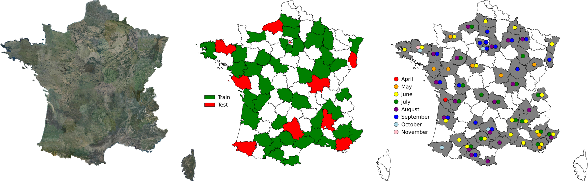
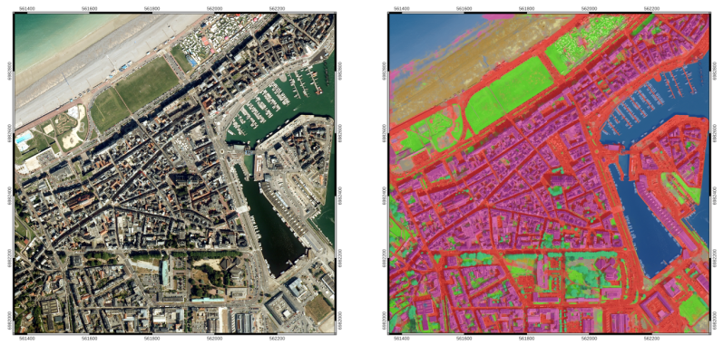
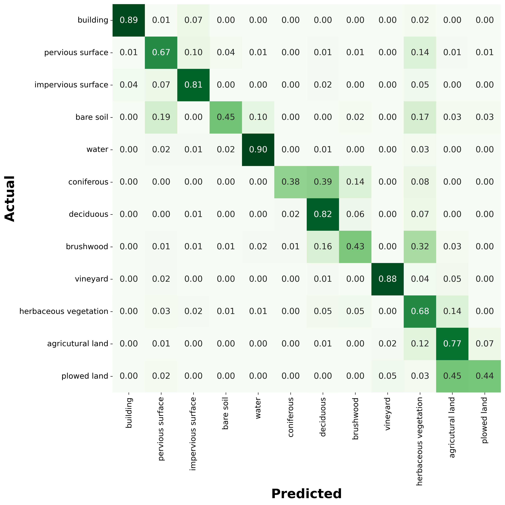

# FLAIR #1 : Semantic segmentation and domain adaptation challenge proposed by the French National Institute of Geographical and Forest Information (IGN).

Participate in obtaining more accurate maps for a more comprehensive description and a better understanding of our environment! Come push the limits of state-of-the-art semantic segmentation approaches on a large and challenging dataset. Get in touch at ai-challenge@ign.fr


<div style="border-width:1px; border-style:solid; border-color:#d2db8c; padding-left: 1em; padding-right: 1em; ">
  
<h2 style="margin-top:5px;">Important links</h2>

**`Datapaper :`** https://arxiv.org/pdf/2211.12979.pdf

**`Dataset links :`** https://ignf.github.io/FLAIR-Challenges/

**`Challenge page :`** https://codalab.lisn.upsaclay.fr/competitions/8769#learn_the_details [🛑 Inscription closed!]

</div>


## Context & Data

The FLAIR #1 dataset is sampled countrywide and is composed of over 20 billion annotated pixels, acquired over three years and different months (spatio-temporal domains). The dataset is available to download <a href="https://ignf.github.io/FLAIR-Challenges/">here.</a> It consists of 512 x 512 patches with 13 (baselines) or 19 (full) semantic classes (see associated datapaper). Each patch has 5 channels (RVB-Infrared-Elevation). 

<br>


<figure>
  
  <figcaption>ORTHO HR® aerial image cover of France (left), train and test spatial domains of the dataset (middle) and acquisition months defining temporal domains (right).</figcaption>
</figure>


<br>
<br>

<figure>
  
  <figcaption style="text-align:center">Example of input data (first three columns) and corresponding supervision masks (last column).</figcaption>
</figure>

<br>


## Baseline model 

A U-Net architecture with a pre-trained ResNet34 encoder from the pytorch segmentation models library is used for the baselines. The used architecture allows integration of patch-wise metadata information and employs commonly used image data augmentation techniques. It has about 24.4M parameters and it is implemented using the _segmentation-models-pytorch_ library. The results are evaluated with an Intersection Over Union (IoU) metric and a single mIoU is reported (see associated datapaper).

The _metadata_ strategy refers encoding metadata with a shallow MLP and concatenate this encoded information to the U-Net encoder output. The _augmentation_ strategy employs three typical geometrical augmentations (see associated datapaper).


Example of a semantic segmentation of an urban and coastal area in the D076 spatial
domain, obtained with the baseline trained model:


<figure>
 
  <figcaption>Example of a semantic segmentation result using the baseline model</figcaption>
</figure>


<br>

## Usage 

The `config.yml` file controls paths, hyperparameters and computing ressources. The file `requirement.txt` is listing used libraries for the baselines.

You can either use : 

- ```
  main.py --conf_file=config.yml
  ```

-  use the `flair-one-baseline.ipynb` notebook guiding you trough data visualization, training and testing.

<br>

## Leaderboard

| Model | mIoU 
------------ | ------------- 
| baseline U-Net (ResNet34) | 0.5443±0.0014
| baseline U-Net (ResNet34) + _metadata + augmentation_ | 0.5570±0.0027


The baseline U-Net with ResNet34 backbone obtains the following confusion matrix: 


<figure>
  
  <figcaption>Baseline confusion matrix of the test dataset normalized by rows.</figcaption>
</figure>


## Reference
Please include a citation to the following paper if you use the FLAIR #1 dataset:

```
@article{garioud2022flair1,
  doi = {10.13140/RG.2.2.30183.73128/1},
  url = {https://arxiv.org/pdf/2211.12979.pdf},
  author = {Garioud, Anatol and Peillet, Stéphane and Bookjans, Eva and Giordano, Sébastien and Wattrelos, Boris},
  title = {FLAIR #1: semantic segmentation and domain adaptation dataset},
  publisher = {arXiv},
  year = {2022}
}
```

## Acknowledgment
This work was performed using HPC/AI resources from
GENCI-IDRIS (Grant 2022-A0131013803).

